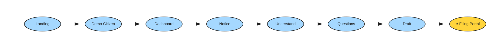

<div align="center">

# Tax Mitra 🇮🇳

**Your Indian Income Tax Notice, Made Understandable.**

Turn confusing Indian income-tax notices into clear explanations, personalized checklists, and response drafts — in your language.

*Built by [@bydhruvil](https://x.com/bydhruvil) for **#buildwhatmovesindia***

<br/>

[](https://taxmitra.bydhruvil.in)
[](https://taxmitra-eight.vercel.app/)
[](https://x.com/bydhruvil)
[](https://x.com/bydhruvil)

<br/>

[](https://react.dev/)
[](https://fastapi.tiangolo.com/)
[](https://railway.app/)
[](https://vercel.com/)
[](backend/)
[](https://taxmitra.bydhruvil.in)

</div>

---

<div align="center">
  
</div>

---

## 🛡️ Core Guiding Principle

> ### **AI EXPLAINS → RULES DECIDE → HUMANS APPROVE**
>
> Tax Mitra assists taxpayers in understanding statutory notices and preparing formal responses. **Tax Mitra never submits on your behalf.** All official filings remain 100% under citizen control and are submitted directly through the official Income Tax e-Filing portal.

---

## 🌟 What It Does

Receiving a tax notice from the Income Tax Department can be intimidating. Tax Mitra simplifies the process through a safe, transparent, and bilingual citizen journey:

- 🔍 **Plain-Language Explanations** — Translates complex legal sections into plain English or Hindi.
- 📄 **142(1) Scrutiny PDF Extraction** — Upload official notice PDFs to extract specific inquiry clauses automatically.
- 🗣️ **Bilingual by Design** — Seamless English and Hindi (हिंदी) language toggling across every step.
- ❓ **Guided Fact Discovery** — Non-intimidating, step-by-step decision flow to identify discrepancies.
- 📝 **Structured Response Drafting** — Pre-fills editable, statutory response drafts grounded in official tax provisions.
- 📋 **Tailored Evidence Checklist** — Lists exact supporting documents required to substantiate your response.
- 🚀 **Official Portal Handoff** — Step-by-step submission instructions with direct links to `incometax.gov.in`.

---

## 🏛️ System Architecture


### High-Level Data Flow:
1. **Citizen & Notice** — Assessee receives an IT notice (Section 143(1)(a) mismatch or Section 142(1) scrutiny PDF) and seeks clear guidance.
2. **React Frontend (Vercel)** — Interactive 4-step UX journey: *Understand ➔ Answer ➔ Prepare ➔ Act* with real-time bilingual switching.
3. **FastAPI Backend (Railway)** — PyPDF text extraction, notice type classification, and deterministic statutory deadline computation.
4. **Rules & Intelligence (Corpus)** — Grounded against authoritative Income Tax Department rules, legal circulars, and AI plain-text generator with offline fallbacks.
5. **Human & Government Portal** — Taxpayer approves the response, gathers checklist evidence, and securely files on `incometax.gov.in`.

---

## 🔄 User Flow

The citizen follows an intuitive, end-to-end journey from receiving a notice to official filing:



```
[ Landing / Notice Select ] ──► [ Understand Discrepancy ] ──► [ Guided Questions ] ──► [ Editable Draft & Checklist ] ──► [ Official e-Filing Portal ]
```

---

## 📋 Supported Notices

| Notice Section | Description | Supported Capabilities |
| :--- | :--- | :--- |
| **Section 143(1)(a)** | Intimation for income / deduction mismatch | Interactive variance breakdown, explanation of proposed additions, draft response generator. |
| **Section 142(1)** | Inquiry / Scrutiny notice | Drag-and-drop PDF extraction, automated clause identification, structured response checklist. |
| **Unsupported Notices** | Penalty, Demand, Prosecution notices | **Refusal Guardrail** — Directs citizen to qualified Chartered Accountants / Tax Advocates. |

---

## 💻 Tech Stack

<div align="center">

| Layer | Technology | Details |
| :--- | :--- | :--- |
| **Frontend** | **React 18 + TypeScript + Vite** | Tailwind CSS, React Router, Bilingual i18n, Lucide Icons |
| **Backend** | **FastAPI + Python 3.11** | Pydantic v2 validation, PyPDF parser, RESTful endpoints |
| **Intelligence** | **Authoritative Corpus + OpenAI** | Deterministic legal rules engine with LLM plain-language translations |
| **Deployment** | **Vercel + Railway** | Vercel (Frontend edge), Railway (FastAPI backend), Custom domain |
| **Testing** | **Pytest** | 67 comprehensive unit & integration test suites |

</div>

---

## 🚀 Quick Start

### Prerequisites
- **Node.js** (v18+)
- **Python** (v3.11+)

### 1. Backend Setup

```bash
cd backend

# Create and activate virtual environment
python -m venv venv
# Windows:
.\venv\Scripts\activate
# macOS/Linux:
# source venv/bin/activate

# Install dependencies
pip install -r requirements.txt

# Start backend dev server
python -m uvicorn app.main:app --host 0.0.0.0 --port 8000 --reload
```

Backend will be accessible at: `http://localhost:8000` (API Docs: `http://localhost:8000/docs`)

### 2. Frontend Setup

```bash
cd frontend

# Install node dependencies
npm install

# Create local environment config
# Ensure VITE_API_BASE_URL=http://localhost:8000 in frontend/.env

# Start frontend dev server
npm run dev
```

Frontend will be accessible at: `http://localhost:5173`

---

## 🧪 Testing & Validation

Tax Mitra includes **67 automated test cases** verifying API contracts, statutory deadline logic, PDF sanitization, classification, and prompt guardrails.

```bash
cd backend
pytest
```

```text
======================= 67 passed in 1.42s =======================
```

---

## 🔒 Security, Privacy & Safety Guardrails

- **Zero Auto-Filing**: Tax Mitra does **NOT** collect portal passwords or file directly with government systems.
- **Client-Centric Privacy**: Uploaded PDFs and notice data are processed in-memory for extraction and never permanently stored.
- **Deterministic Rules Engine**: Statutory dates, interest provisions, and variance mathematics are computed deterministically without relying on generative AI for calculations.
- **Static Fallback Resilience**: If AI services are unavailable, Tax Mitra automatically falls back to curated, authoritative static response templates.

---

## ⚖️ Disclaimer

Tax Mitra is an independent citizen-assistance prototype built for educational and informational purposes. It is not affiliated with, endorsed by, or sponsored by the Income Tax Department or the Government of India. All simulated data is fictional and synthetic. Official response filing remains with the taxpayer through the official Income Tax e-Filing portal ([incometax.gov.in](https://www.incometax.gov.in)). For complex legal disputes or high-value scrutiny cases, taxpayers are advised to consult a qualified Chartered Accountant (CA) or legal professional.

---

<div align="center">
  <sub>Built with ❤️ by <a href="https://x.com/bydhruvil"><b>@bydhruvil</b></a> for <b>#buildwhatmovesindia</b> • <b>Tax Mitra 🇮🇳</b></sub>
</div>
