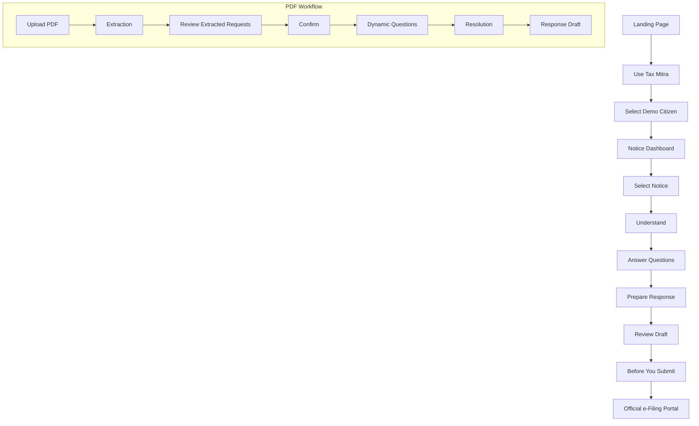
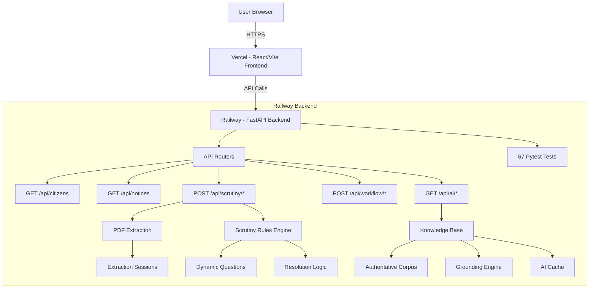
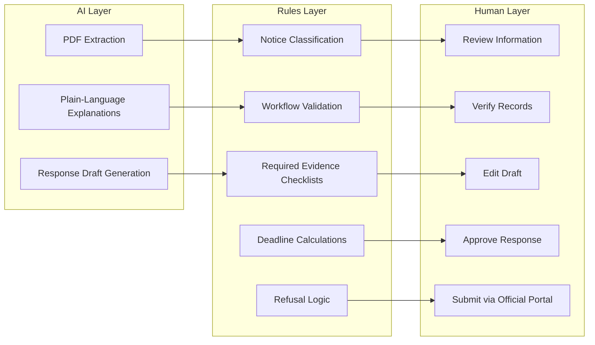
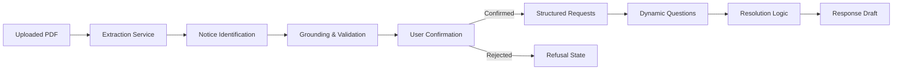

# Tax Mitra 🇮🇳

**Your tax notice, made understandable.**

Tax Mitra turns a confusing Indian income-tax notice into clear explanations, a personalized document checklist, an editable response draft, and a clear next official step — in your language, with every claim traceable to official sources.

---

<!--
  HERO IMAGE:
  Replace the placeholder below with the final Tax Mitra hero screenshot.
-->

[ Tax Mitra Hero Screenshot ]

---

## Live Demo

**[Tax Mitra](https://taxmitra-eight.vercel.app/)**

- **Frontend:** Deployed on Vercel
- **Backend:** Deployed on Railway
- The frontend communicates with the FastAPI backend through the production API

---

## Project Overview

Indian income-tax notices are written in technical legal language and reference complex procedures. For ordinary taxpayers, understanding what the notice means, what information is required, and how to respond is difficult and stressful.

Tax Mitra is a guided digital experience that bridges this gap. It:

- **Explains** your notice in plain language (English or Hindi)
- **Identifies** exactly what information the department is requesting
- **Guides** you through a simple question-and-answer flow
- **Generates** a personalized response draft
- **Directs** you to the official e-Filing portal for submission

### The Core Principle

**AI EXPLAINS → RULES DECIDE → HUMANS APPROVE**

- **AI explains** — Generates plain-language explanations and structures information from your notice
- **Rules decide** — Deterministic business logic validates workflows, determines required evidence, and generates checklists
- **Humans approve** — You review all information, verify your records, and submit through the official government portal

Tax Mitra never submits anything on your behalf. The official e-Filing portal remains the only authoritative submission channel.

---

## Why Tax Mitra

| Problem | Tax Mitra |
|---------|-----------|
| Notices use technical legal language | Plain-language explanations in your language |
| Hard to know what documents are needed | Personalized document checklist with "why this is required" |
| Unclear what to respond to | Structured request decomposition from PDF |
| Don't know the right procedure | Step-by-step action guidance with official portal links |
| Risk of missing deadlines | Deadline tracking with clear status indicators |
| Language barrier | Instant English/Hindi toggle throughout |

---

## Key Features

- **Notice Understanding** — Plain-language explanations of notice sections with citations to official sources
- **PDF Upload & Extraction** — Upload a Section 142(1) scrutiny notice PDF to extract and structure requests
- **Request Decomposition** — Complex notices broken down into individual, actionable requests
- **Bilingual Support** — Full English/Hindi support with instant language toggle
- **Dynamic Questions** — Context-aware questions that adapt to your situation
- **Evidence Guidance** — Clear list of required documents with explanations
- **Response Draft Generation** — Editable response draft pre-filled based on your answers
- **Draft Download** — Download your draft as a text file
- **Copy to Clipboard** — Quick copy for pasting into the official portal
- **Notice-Specific Action Guidance** — Step-by-step instructions tailored to your notice type
- **Official e-Filing Handoff** — Direct links to the official portal with clear boundaries
- **Scrutiny Workflow** — Specialized workflow for Section 142(1) scrutiny notices
- **Refusal/Unsupported States** — Clear communication when a notice type is not supported
- **Synthetic Demo Flow** — Demo citizen (Aarav Sharma) with pre-loaded notices for exploration

---

## User Flow



---

## System Architecture



---

## AI / Decision Architecture



### AI Responsibilities
- **Extracting and structuring** information from PDF notices
- **Generating** human-readable explanations from the knowledge base
- **Drafting** response text based on deterministic rule outputs

### Rules Responsibilities
- **Classifying** notice types (143(1)(a), 142(1), unsupported)
- **Deciding** supported vs unsupported workflows
- **Computing** statutory deadlines and response windows
- **Generating** required evidence checklists
- **Determining** response paths based on user answers
- **Enforcing** grounding confidence floors

### Human Responsibilities
- **Reviewing** all extracted information
- **Verifying** personal records against requests
- **Editing** the response draft as needed
- **Approving** the final response
- **Submitting** through the official e-Filing portal

---

## PDF Extraction Pipeline



The extraction pipeline processes PDF notices, identifies the notice type and requests, validates against the knowledge base with confidence scoring, and requires human confirmation before proceeding to the scrutiny workflow. This ensures accuracy and allows users to verify the extraction before relying on it.

---

## Knowledge Base

The knowledge base is an authoritative corpus of official Indian Income Tax Department sources, including:

- **Section overviews** — 139(9), 142(1), 143(1)(a), 144, 144B
- **Procedural guides** — How to agree/disagree, response windows, evidence requirements
- **FAQs** — Common questions about assessments, appeals, scrutiny
- **Glossary** — Key terms like assessment year, intimation, etc.
- **Notification references** — Specific government notifications

All corpus files are stored in `backend/app/knowledge/corpus/` and are loaded at runtime. The retriever uses both embedding-based and lexical search to find relevant passages, with a confidence floor to prevent low-quality responses.

---

## Supported Notice Types

### Currently Supported

| Section | Category | Workflow |
|---------|----------|----------|
| 143(1)(a) | Income Mismatch | Full workflow with dynamic questions, checklist, and draft |
| 142(1) | Scrutiny | PDF extraction workflow with confirmation, questions, and resolution |

### Unsupported

- Section 148 and other notice types are explicitly marked as unsupported
- Unsupported notices display a clear refusal screen with explanation
- Users are directed to professional help for unsupported types

Tax Mitra is focused on common notice types that affect ordinary taxpayers. The scope is intentionally limited to ensure high-quality guidance for supported workflows.

---

## Safety & Trust

### What Tax Mitra Does

- Helps you understand your notice
- Structures information from your notice
- Provides explanations with official citations
- Generates a response draft based on your inputs
- Guides you to the official submission portal

### What Tax Mitra Does NOT Do

- Replace professional tax or legal advice
- Submit responses on your behalf
- Guarantee the accuracy of official interpretations
- Access or store your actual tax data
- Affiliate with the Income Tax Department

### Your Responsibilities

- Review all information for accuracy
- Verify your personal records
- Edit the response draft as needed
- Submit through the official e-Filing portal
- Seek professional advice for complex situations

---

## Tech Stack

### Frontend
- **React 18** — UI framework
- **TypeScript** — Type safety
- **Vite** — Build tool and dev server
- **React Router** — Client-side routing
- **Tailwind CSS v4** — Styling
- **Fontsource** — Typography (Inter, IBM Plex Mono, Noto Sans Devanagari)

### Backend
- **Python 3.11+** — Runtime
- **FastAPI** — Web framework
- **Uvicorn** — ASGI server
- **Pydantic** — Data validation
- **OpenAI** — AI provider (optional, with static fallbacks)
- **PyPDF** — PDF extraction
- **NumPy** — Numerical operations
- **SlowAPI** — Rate limiting

### Infrastructure
- **Vercel** — Frontend hosting
- **Railway** — Backend hosting
- **GitHub** — Version control

---

## Project Structure

```
tax-mitra/
├── backend/
│   ├── app/
│   │   ├── ai/              # OpenAI provider, caching, static fallbacks
│   │   ├── data/            # Synthetic citizens and notices (fictional)
│   │   ├── extraction/      # PDF extraction and sessions
│   │   ├── knowledge/       # Corpus loader, retriever, grounding
│   │   ├── routers/         # API endpoints (notices, workflow, ai, scrutiny)
│   │   ├── rules/           # Deterministic decision logic
│   │   ├── static_fallbacks/# Pre-generated content
│   │   ├── config.py        # Configuration
│   │   ├── data_store.py    # Data access layer
│   │   └── main.py          # FastAPI application
│   ├── tests/               # Pytest suite (67 tests)
│   ├── scripts/             # Build utilities
│   ├── Procfile             # Railway deployment
│   └── requirements.txt     # Python dependencies
├── frontend/
│   ├── src/
│   │   ├── components/      # Reusable UI components
│   │   ├── pages/           # Route components (Landing, Login, Dashboard, etc.)
│   │   ├── i18n.tsx         # Internationalization
│   │   ├── lib.ts           # API client and state management
│   │   ├── index.css        # Global styles
│   │   └── main.tsx         # Application entry
│   ├── vercel.json          # Vercel configuration
│   ├── .env.production      # Production environment variables
│   └── package.json         # Node dependencies
└── README.md
```

---

## Local Development

### Prerequisites

- Python 3.11+
- Node.js 18+
- npm or yarn

### Backend Setup

```bash
cd backend
pip install -r requirements.txt
python -m uvicorn app.main:app --host 0.0.0.0 --port 8000 --reload
```

The backend will be available at `http://localhost:8000`

### Frontend Setup

```bash
cd frontend
npm install
npm run dev
```

The frontend will be available at `http://localhost:5173`

### Environment Variables

**Frontend** (`frontend/.env` for local development):
```
VITE_API_BASE_URL=http://localhost:8000
```

**Backend** (optional, see `backend/app/config.py`):
- `OPENAI_API_KEY` — For live AI generation (optional, static fallbacks available)
- `DEMO_MODE` — Set to `true` to force static fallbacks

---

## Testing

Run the backend test suite:

```bash
cd backend
pytest
```

The test suite covers:
- API contracts and error handling
- Deadline calculations and status boundaries
- Notice classification
- Response path resolution (27 answer combinations)
- Scrutiny rules and questions
- PDF extraction
- Grounding and retrieval
- Demo mode behavior

**Current test count:** 67 tests

---

## Deployment

### Production Architecture

```
Vercel (Frontend)
  ↓ HTTPS
Railway (Backend)
```

### Frontend (Vercel)

- **Root Directory:** `frontend`
- **Build Command:** `npm run build`
- **Output Directory:** `dist`
- **Environment Variable:** `VITE_API_BASE_URL=https://web-production-cfee8.up.railway.app`
- **Configuration:** `frontend/vercel.json` provides SPA rewrite rules

### Backend (Railway)

- **Build Command:** `pip install -r requirements.txt`
- **Start Command:** `python -m uvicorn app.main:app --host 0.0.0.0 --port $PORT`
- **CORS:** Configured to allow both localhost and the production Vercel origin

### CORS Configuration

The backend CORS middleware allows:
- `http://localhost:5173` (local development)
- `http://127.0.0.1:5173` (local development)
- `https://taxmitra-eight.vercel.app` (production)

---

## API Overview

### Citizens & Notices

- `GET /api/citizens` — List demo citizens
- `GET /api/notices?citizen_id={id}` — List notices for a citizen
- `GET /api/notices/{id}` — Get notice details
- `GET /api/notices/{id}/refusal` — Get refusal payload for unsupported notices

### Workflow

- `GET /api/workflow/questions/{id}?locale={locale}` — Get guided questions
- `POST /api/workflow/resolve` — Resolve workflow path and generate draft

### AI / Explanations

- `GET /api/ai/explanation/{id}?locale={locale}` — Get plain-language explanation with citations

### Scrutiny (PDF Workflow)

- `POST /api/scrutiny/extract` — Extract requests from PDF
- `POST /api/scrutiny/confirm` — Confirm extraction (required before proceeding)
- `GET /api/scrutiny/{id}/requests?locale={locale}` — Get extracted requests
- `GET /api/scrutiny/{id}/questions?locale={locale}` — Get scrutiny questions
- `POST /api/scrutiny/resolve` — Resolve scrutiny workflow

---

## Screenshots

### Landing Page
<!-- SCREENSHOT PLACEHOLDER -->

### Notice Understanding
<!-- SCREENSHOT PLACEHOLDER -->

### Scrutiny Workflow
<!-- SCREENSHOT PLACEHOLDER -->

### Response Draft
<!-- SCREENSHOT PLACEHOLDER -->

### Final Action Guide
<!-- SCREENSHOT PLACEHOLDER -->

---

## Roadmap

Potential future improvements:

- Support for additional notice types (e.g., Section 148)
- More sophisticated PDF OCR for scanned notices
- Integration with actual e-Filing portal APIs (if available)
- Multi-citizen support for tax professionals
- Export to official response formats

---

## Contributing

Contributions are welcome! Please:

1. Fork the repository
2. Create a feature branch
3. Make your changes
4. Ensure tests pass (`pytest`)
5. Ensure the frontend builds (`npm run build`)
6. Submit a pull request

---

## Disclaimer

Tax Mitra is an **independent prototype** created for educational purposes. All data shown is **fictional and synthetic**. Tax Mitra is **not** an official Income Tax Department service, is not affiliated with the Government of India, and never submits anything on a citizen's behalf.

The official e-Filing portal remains the authoritative source and the only official submission channel. For complex tax situations, please consult a qualified Chartered Accountant or tax professional.

---

## License

This project is provided as-is for educational and demonstration purposes.
